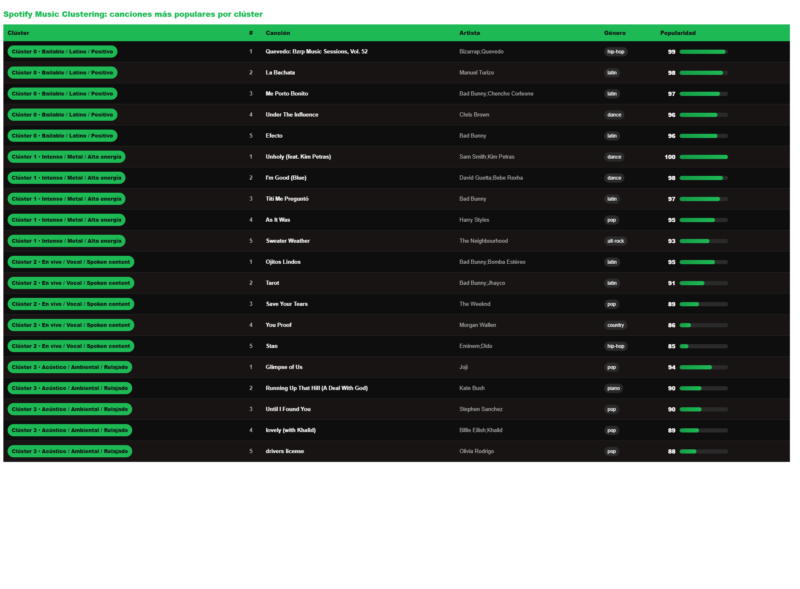

# Spotify Music Clustering

<p align="center">
  
</p>

## Descripción del proyecto

Este proyecto aplica técnicas de aprendizaje de máquina no supervisado para segmentar canciones de Spotify según sus características de audio.

El objetivo principal es descubrir patrones musicales ocultos en el dataset y agrupar canciones similares mediante algoritmos de clustering. Para ello, se utilizaron variables como `danceability`, `energy`, `acousticness`, `instrumentalness`, `liveness`, `speechiness`, `valence`, `tempo`, `loudness` y `popularity`.

A diferencia de un modelo supervisado, este proyecto no busca predecir una variable objetivo. En cambio, utiliza las características de audio disponibles para encontrar grupos naturales dentro de las canciones.

---

## Objetivo

Aplicar aprendizaje no supervisado para identificar perfiles musicales dentro de un conjunto de canciones de Spotify, utilizando técnicas de clustering, reducción dimensional y visualización de datos.

---

## Dataset

El dataset utilizado corresponde a canciones de Spotify con características de audio.

Fuente del dataset:

[Spotify Tracks Dataset - Audio Features en Kaggle](https://www.kaggle.com/datasets/saichaitanyareddyai/spotify-tracks-dataset-audio-features)

El dataset contiene información como:

- Nombre de la canción
- Artista
- Género
- Popularidad
- Duración
- Bailabilidad
- Energía
- Volumen
- Acústica
- Instrumentalidad
- Presencia en vivo
- Valencia emocional
- Tempo

La variable `track_genre` no fue utilizada para entrenar el modelo. Se utilizó únicamente como apoyo para interpretar los clústeres obtenidos.

---

## Herramientas utilizadas

- Python
- Pandas
- NumPy
- Matplotlib
- Seaborn
- Scikit-learn
- Jupyter Notebook

---

## Técnicas aplicadas

- Análisis exploratorio de datos
- Limpieza de datos
- Selección de variables numéricas
- Escalamiento con StandardScaler
- K-Means Clustering
- Método del codo
- Silhouette Score
- PCA
- t-SNE
- Análisis de perfiles promedio por clúster
- Visualización de géneros dominantes
- Interpretación de clústeres

---

## Flujo del proyecto

1. Carga del dataset
2. Exploración inicial de los datos
3. Limpieza y revisión de valores nulos
4. Selección de variables de audio
5. Escalamiento de variables
6. Evaluación del número de clústeres
7. Entrenamiento del modelo K-Means
8. Visualización de clústeres con PCA y t-SNE
9. Interpretación de los perfiles musicales
10. Análisis de géneros y canciones más representativas por clúster
11. Conclusiones finales

---

## Visualizaciones principales

### Método del codo

<p align="center">
  
</p>

El método del codo fue utilizado para observar cómo disminuye la inercia a medida que aumenta el número de clústeres. Esta visualización ayuda a seleccionar una cantidad razonable de grupos para el modelo K-Means.

---

### Evaluación con Silhouette Score

<p align="center">
  
</p>

El Silhouette Score permitió evaluar qué tan bien separados se encontraban los clústeres. Esta métrica fue utilizada como complemento al método del codo.

---

### Visualización de clústeres con PCA

<p align="center">
  
</p>

PCA permitió reducir las variables originales a dos componentes principales para representar visualmente los clústeres en un espacio bidimensional.

---

### Visualización de clústeres con t-SNE

<p align="center">
  
</p>

t-SNE fue utilizado como técnica de reducción dimensional no lineal para explorar la separación visual de los grupos musicales.

---

### Perfil promedio por clúster

<p align="center">
  
</p>

El heatmap muestra el perfil promedio estandarizado de cada clúster. Esta visualización permitió interpretar las principales diferencias entre los grupos según sus características de audio.

---

### Géneros dominantes por clúster

<p align="center">
  
</p>

Este gráfico muestra los géneros más frecuentes dentro de cada clúster. Aunque el género no fue utilizado para entrenar el modelo, permitió validar e interpretar musicalmente los grupos encontrados.

---

### Canciones más populares por clúster

<p align="center">
  
</p>

Esta tabla permite observar las canciones más populares dentro de cada perfil musical identificado por el modelo.

---

### Distribución de canciones por clúster

<p align="center">
  
</p>

Esta visualización permite revisar cuántas canciones fueron asignadas a cada clúster, ayudando a evaluar la distribución de los grupos obtenidos.

---

### Radar chart por clúster

<p align="center">
  
</p>

El radar chart resume las características musicales promedio de cada clúster, facilitando la comparación visual entre perfiles.

---

## Resultados obtenidos

El modelo permitió identificar cuatro perfiles musicales principales:

| Clúster | Perfil interpretado | Características principales |
|---|---|---|
| Clúster 0 | Bailable / Latino / Positivo | Alta bailabilidad, mayor valence y perfil rítmico |
| Clúster 1 | Intenso / Metal / Alta energía | Mayor energía, loudness y tempo |
| Clúster 2 | En vivo / Vocal / Spoken content | Alta presencia de liveness y speechiness |
| Clúster 3 | Acústico / Ambiental / Relajado | Alta acousticness e instrumentalness, menor energía |

---

## Interpretación general

El análisis permitió observar que las canciones pueden agruparse en perfiles musicales coherentes usando únicamente características de audio.

El clúster bailable y positivo agrupa canciones con mayor `danceability` y `valence`, mientras que el clúster intenso presenta valores elevados de `energy`, `loudness` y `tempo`.

Por otro lado, el clúster asociado a contenido en vivo o vocal destaca por valores altos de `liveness` y `speechiness`. Finalmente, el clúster acústico y ambiental presenta mayor `acousticness` e `instrumentalness`, junto con menor energía y menor volumen.

Estos resultados muestran que el aprendizaje no supervisado puede ser útil para explorar catálogos musicales, detectar patrones de audio y construir segmentaciones interpretables.

---

## Aplicaciones posibles

Este tipo de análisis podría utilizarse en:

- Sistemas de recomendación musical
- Creación automática de playlists
- Segmentación de catálogos musicales
- Análisis de géneros y estilos musicales
- Exploración de patrones de consumo musical
- Organización de bibliotecas musicales extensas

---

## Estructura del repositorio

```text
spotify-music-clustering/
│
├── data/
│   └── spotify_tracks.csv
│
├── images/
│   ├── spotify_music_clustering_banner.png
│   ├── elbow_method.png
│   ├── silhouette_score.png
│   ├── pca_clusters.png
│   ├── tsne_clusters.png
│   ├── cluster_profile_heatmap.png
│   ├── top_genres_by_cluster.png
│   ├── top_tracks_by_cluster.png
│   ├── cluster_size.png
│   └── radar_clusters.png
│
├── notebook/
│   └── spotify_music_clustering.ipynb
│
├── README.md
└── requirements.txt
